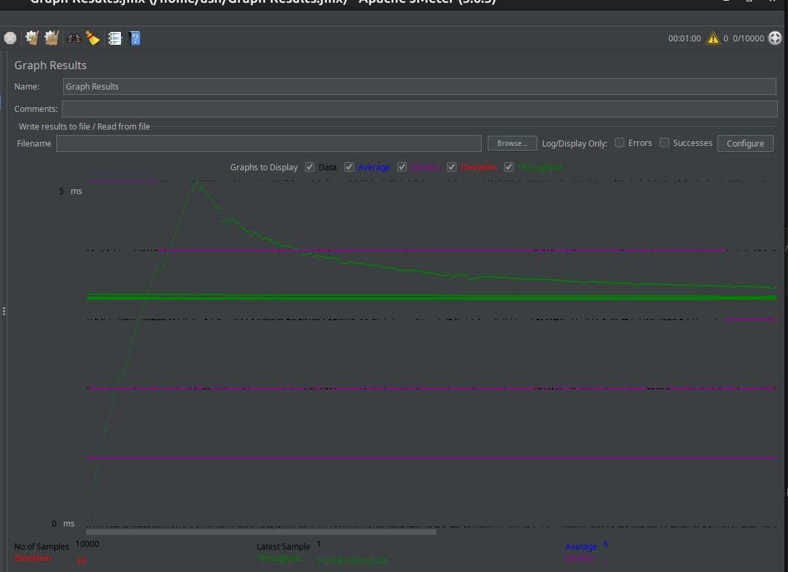

# Java Web Server — Concurrency Evolution

**Java 21 · Sockets · Concurrency · Performance Engineering**

A ground-up exploration of how Java web servers scale — from a single blocking thread all the way to virtual threads with in-memory caching. Each implementation is a deliberate step that exposes a real bottleneck, measures it under load, and then addresses it in the next stage.

---

## Table of Contents

- [Project Overview](#project-overview)
- [Architecture Evolution](#architecture-evolution)
  - [Stage 1 — Single-Threaded](#stage-1--single-threaded)
  - [Stage 2 — Thread-per-Request](#stage-2--thread-per-request)
  - [Stage 3 — Thread Pool](#stage-3--thread-pool)
  - [Stage 4 — Virtual Threads (no cache)](#stage-4--virtual-threads-no-cache)
  - [Stage 5 — Virtual Threads + Caching](#stage-5--virtual-threads--caching-optimized)
- [Benchmark Results](#benchmark-results)
- [Trade-off Summary](#trade-off-summary)
- [Project Structure](#project-structure)
- [Running the Servers](#running-the-servers)
- [Test Environment](#test-environment)

---

## Project Overview

Each server implementation answers one question: *what breaks first, and why?*  
The workload is identical across all stages — serve a JSON file read from disk over HTTP/1.1 — making the concurrency model the only variable.

Load is applied with **Apache JMeter**: 10,000 concurrent users, 60-second ramp-up, one loop per user.

---

## Architecture Evolution

### Stage 1 — Single-Threaded

**Directory:** `Singlethreaded/`  
**Port:** `8010`

```java
while (true) {
    Socket client = serverSocket.accept();
    handleRequest(client);   // entire server blocks here
}
```

The accept loop and the request handler share the same thread. While one client is being served, every other connection waits in the OS backlog. A single slow request serializes all others.

**Bottleneck:** Head-of-line blocking. Throughput is capped at `1 request / avg_service_time`.

---

### Stage 2 — Thread-per-Request

**Directory:** `Multithreaded/`  
**Port:** `8010`

```java
while (true) {
    Socket client = serverSocket.accept();
    new Thread(() -> handleRequest(client)).start();
}
```

Concurrent requests are now served in parallel. However, each OS (platform) thread consumes ~1–2 MB of stack space. Under high load this becomes a memory and context-switching problem — the JVM or OS will eventually refuse to create new threads.

**Bottleneck:** Unbounded thread creation. Fine for low concurrency; dangerous at scale.

---

### Stage 3 — Thread Pool

**Directory:** `ThreadPool/`  
**Port:** `8010`  
**Pool size:** `100 workers`

```java
ExecutorService pool = Executors.newFixedThreadPool(100);

while (true) {
    Socket client = serverSocket.accept();
    pool.execute(() -> handleRequest(client));
}
```

Thread creation cost is paid once at startup. Excess requests queue rather than spawning new threads, giving the server a predictable memory footprint and protecting against thread exhaustion. Includes graceful shutdown via `shutdown()` / `awaitTermination()`.

**Bottleneck:** When all 100 threads are busy with disk I/O, new requests queue up. The median improves dramatically but a long tail remains — driven by queuing time behind blocked pool threads.

---

### Stage 4 — Virtual Threads (no cache)

**Directory:** `VirtualThreads-without-caching/`  
**Port:** `8020`

```java
ExecutorService executor = Executors.newVirtualThreadPerTaskExecutor();

while (true) {
    Socket client = serverSocket.accept();
    executor.execute(() -> handleRequest(client));
}
```

Virtual threads (JDK 21+) are managed by the JVM, not the OS. They are cheap to create (~1–10 KB each), so there is no need to bound the pool. When a virtual thread blocks on I/O the JVM parks it and recycles the underlying carrier thread for other work.

Because every request still reads `data.json` from disk, disk I/O remains the dominant cost per request — virtual threads remove the threading overhead but cannot eliminate the I/O bottleneck itself.

**Bottleneck:** Disk I/O on every request. Virtual threads ≠ faster I/O.

---

### Stage 5 — Virtual Threads + Caching (Optimized)

**Directory:** `VirtualThreads-with-caching/`  
**Port:** `8010`

```java
// At startup — read once, hold in memory forever
this.cachedJsonResponse = new String(Files.readAllBytes(Paths.get("../data.json")));

// Per request — no disk access
toSocket.println(cachedJsonResponse);
```

The JSON payload is loaded into memory at startup. Every subsequent request reads from a `String` field in the heap — nanoseconds instead of milliseconds. Combined with unlimited virtual threads and a 10,000-connection backlog, this removes both the threading ceiling and the I/O bottleneck simultaneously.

Also includes live metrics (`AtomicLong` counters for active connections and total requests) and a JVM shutdown hook for graceful termination.

**Result:** Tail latency is effectively eliminated. Median and mean converge.

---

## Benchmark Results

All tests: **10,000 users · 60 s ramp-up · 1 loop · Intel i7-7600U (4 cores) · 16 GB RAM**

### Full Percentile Comparison

| Implementation | Avg | p50 | p90 | p95 | p99 | Max | Throughput |
|---|---|---|---|---|---|---|---|
| Single-Threaded | 2 ms | 1 ms | 5 ms | 8 ms | 18 ms | 112 ms | 166.7 req/s |
| Thread Pool (100 workers) | 1 ms | 1 ms | 2 ms | 3 ms | 6 ms | 77 ms | 166.7 req/s |
| Virtual Threads + Cache | 1 ms | 1 ms | 2 ms | 3 ms | 6 ms | 79 ms | 166.7 req/s |

> **Error rate: 0.00% across all three implementations.**

---

### Reading the numbers

**p50 (median)** — the typical user experience. All three implementations sit at 1 ms, so the median alone is misleading here.

**p90** — where the implementations begin to diverge. Single-threaded hits 5 ms while the other two hold at 2 ms. 10% of requests are slower than this value.

**p99** — the clearest signal of tail behaviour. Single-threaded reaches **18 ms** — 3× worse than the thread pool and virtual threads (6 ms). Under higher concurrency this gap widens dramatically (see historical graphs below). The 1 in 100 requests landing here becomes very visible at scale.

**Max** — single-threaded peaks at **112 ms**, about 45% higher than the thread pool's 77 ms ceiling. Max is noisy (one outlier), but the direction is consistent with p99.

---

### Historical load graphs (10 K users, earlier runs)

These earlier JMeter runs used a heavier load profile and show the breakdown point of each model more clearly.

| Single-Threaded | Thread Pool |
|---|---|
|  |  |



---

## Trade-off Summary

| Implementation | Concurrency Model | Memory / connection | Disk I/O / request | p50 | p99 | Max | Heavy Tail? |
|---|---|---|---|---|---|---|---|
| Single-Threaded | Serial — one request at a time | N/A | Yes | 1 ms | 18 ms | 112 ms | Yes — grows with load |
| Thread-per-Request | 1 OS thread per connection | ~1–2 MB | Yes | — | — | — | Yes — OOM risk |
| Thread Pool (100) | Fixed OS thread pool | ~1–2 MB × pool size | Yes | 1 ms | 6 ms | 77 ms | Yes — queue backs up |
| Virtual Threads (no cache) | 1 virtual thread per connection | ~1–10 KB | Yes | Low | Moderate | — | Reduced vs pool |
| Virtual Threads + Cache | 1 virtual thread per connection | ~1–10 KB | **No** | 1 ms | 6 ms | 79 ms | **No** |

**Key insight:** Virtual threads solve the *concurrency* problem (thread count, memory). Caching solves the *throughput* problem (disk I/O). The p99 gap between single-threaded (18 ms) and the rest (6 ms) is modest at this load level — but the gap scales non-linearly as concurrency increases, which is exactly what the historical graphs above capture.

---

## Project Structure

```
multithreaded-webserver/
├── Singlethreaded/                    # Stage 1 — blocking, serial
│   └── Server.java
├── Multithreaded/                     # Stage 2 — thread per connection
│   └── Server.java
├── ThreadPool/                        # Stage 3 — fixed thread pool (100 workers)
│   └── ThreadPoolServer.java
├── VirtualThreads-without-caching/    # Stage 4 — virtual threads, disk I/O per request
│   └── Server.java
├── VirtualThreads-with-caching/       # Stage 5 — virtual threads + in-memory cache
│   ├── Server.java
│   └── OptimizedServer.java           # Adds live metrics & shutdown hook
├── Images/                            # JMeter graphs for each stage
├── data.json                          # Payload served by all implementations
├── LoadApplied-Metrics.md             # JMeter test parameters
└── hardwareSpecs.md                   # Test machine specs
```

---

## Running the Servers

**Prerequisites:** Java 21+, `data.json` present in the repo root.

```bash
# Stage 1 — Single-Threaded (port 8010)
cd Singlethreaded
javac Server.java && java Server

# Stage 3 — Thread Pool (port 8010)
cd ThreadPool
javac ThreadPoolServer.java && java -cp .. ThreadPool.ThreadPoolServer

# Stage 5 — Virtual Threads + Cache (port 8010)
cd VirtualThreads-with-caching
javac OptimizedServer.java && java OptimizedServer

# Quick smoke test
curl -i http://localhost:8010
```

To reproduce the benchmarks, open Apache JMeter and configure:
- **Threads (users):** 10,000
- **Ramp-up period:** 60 s
- **Loop count:** 1
- **Target:** `http://localhost:8010`

---

## Test Environment

| Component  | Detail                        |
|------------|-------------------------------|
| CPU        | Intel Core i7-7600U × 4 cores |
| RAM        | 16 GB                         |
| Java       | JDK 21+                       |
| Load tool  | Apache JMeter                 |

---

**Built by Ashton** · [GitHub](https://github.com/ashd19)
