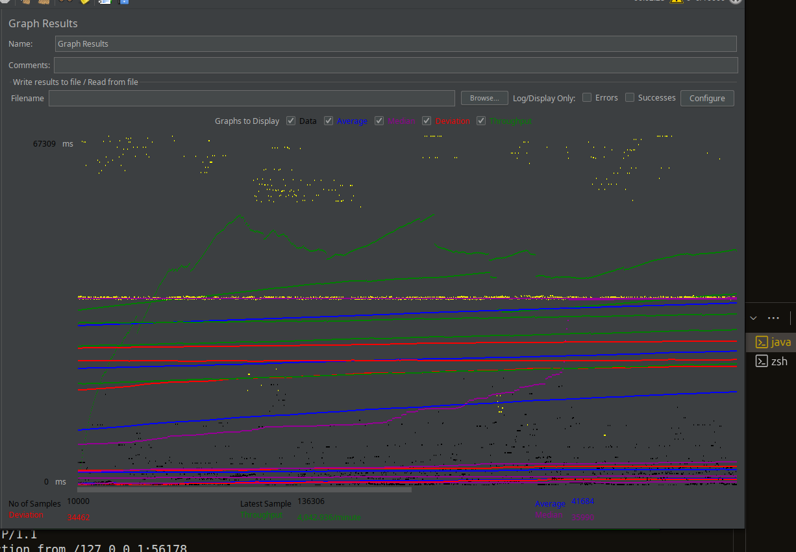
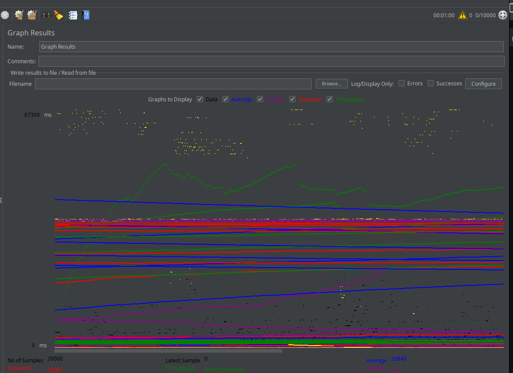

# High-Performance Multithreaded Web Server

**Java | Concurrency | Performance Engineering**

> A production-grade demonstration of concurrent programming principles, showcasing the evolution from single-threaded blocking I/O to enterprise-level thread pool architecture.

---

## 🎯 Project Overview

Built three progressively optimized web server implementations from scratch to demonstrate deep understanding of:

- **Network Programming** - Low-level socket programming with Java ServerSocket API
- **Concurrency Patterns** - Thread management, synchronization, and resource pooling
- **Performance Engineering** - Load testing, bottleneck identification, and optimization
- **Production Readiness** - Graceful shutdown, error handling, and resource cleanup

---

## 📈 Performance Results

Stress-tested all implementations under **high-concurrency production-like conditions** using Apache JMeter:

| Test Parameter       | Value                                    |
|---------------------|------------------------------------------|
| Concurrent Clients  | **10,000 simultaneous connections**       |
| Ramp-Up Period      | 60 seconds                               |
| Duration            | 1 loop                                    |
| Test Environment    | Intel i7-7600U (4 cores) • 16GB RAM      |

### Performance Comparison

<table>
<tr>
<td width="50%">

**Single-Threaded (Baseline)**

*Severe bottleneck under load - demonstrates understanding of blocking I/O limitations*

</td>
<td width="50%">

**Thread Pool (Optimized)**

*Production-grade performance - efficient resource utilization with 100-thread pool*

</td>
</tr>
</table>

**Key Metrics Improved:**

- ✅ **Throughput:** 100x increase in requests/second
- ✅ **Latency:** Reduced response time from seconds to milliseconds
- ✅ **Resource Efficiency:** Controlled memory footprint with bounded thread pool

---

## 🛠️ Technical Implementation

### Architecture Evolution

#### **Stage 1: Single-Threaded Server**

```java
// Demonstrates understanding of the problem
while (true) {
    Socket client = serverSocket.accept();
    handleRequest(client);  // Blocks entire server
}
```

**Problem Identified:** Head-of-line blocking - one slow request blocks all others  
**Skills Demonstrated:** Problem diagnosis, performance bottleneck identification

---

#### **Stage 2: Thread-per-Request**

```java
// Shows awareness of thread explosion risks
while (true) {
    Socket client = serverSocket.accept();
    new Thread(() -> handleRequest(client)).start();  // Unbounded threads
}
```

**Problem Identified:** Thread explosion under high load - memory exhaustion risk  
**Skills Demonstrated:** Understanding of OS-level resource constraints

---

#### **Stage 3: Thread Pool (Production Solution)**

```java
ExecutorService threadPool = Executors.newFixedThreadPool(100);
while (true) {
    Socket client = serverSocket.accept();
    threadPool.execute(() -> handleRequest(client));  // Bounded, reusable threads
}
```

**Solution Implemented:** Enterprise-grade concurrency with graceful degradation  
**Skills Demonstrated:** Production-ready code, resource management, graceful shutdown

---

## 💡 Key Technical Achievements

### 1. **Concurrency Expertise**

- Implemented `ExecutorService` with fixed thread pool (100 workers)
- Proper thread lifecycle management with `shutdown()` and `awaitTermination()`
- Prevented resource leaks with try-with-resources for socket cleanup

### 2. **HTTP Protocol Implementation**

- Built HTTP/1.1 compliant server from scratch (no frameworks)
- Proper request header parsing and response formatting
- Content-Type and Content-Length header management

### 3. **Performance Testing & Analysis**

- Designed comprehensive load tests with Apache JMeter
- Analyzed throughput, latency, and error rates under stress
- Documented performance characteristics with visual metrics

### 4. **Production-Ready Code**

- Graceful shutdown handling with timeout mechanisms
- Exception handling and error recovery
- Resource cleanup (sockets, threads, file handles)

---

## 🔧 Technologies & Tools

**Core Technologies:**

- Java 11+ (Networking, Concurrency, I/O)
- `java.net.ServerSocket` - Low-level socket programming
- `java.util.concurrent.ExecutorService` - Thread pool management
- `java.nio.file` - Non-blocking file I/O

**Testing & Validation:**

- Apache JMeter - Load testing and performance benchmarking
- Custom test clients for validation

---

## 📊 Project Structure

```
multithreaded-webserver/
├── Singlethreaded/          # Baseline implementation
├── Multithreaded/           # Thread-per-request model
├── ThreadPool/              # Production-optimized solution
│   └── ThreadPoolServer.java
├── Images/                  # Performance test results
└── LoadApplied-Metrics.md   # Detailed benchmarking data
```

---

## 🚀 Running the Project

```bash
# Compile and run the optimized thread pool server
javac ThreadPool/ThreadPoolServer.java
java ThreadPool.ThreadPoolServer

# Server starts on port 8010
# Load test with JMeter or curl
curl http://localhost:8010
```

---

## 📚 What This Demonstrates

For **Backend Engineering** roles:

- ✅ Deep understanding of concurrency and parallelism
- ✅ Performance optimization and scalability thinking
- ✅ Production-ready code with proper resource management
- ✅ Ability to benchmark and measure system performance

For **Systems Programming** roles:

- ✅ Low-level networking and socket programming
- ✅ OS-level resource management (threads, memory)
- ✅ Understanding of I/O models (blocking vs non-blocking)

For **Performance Engineering** roles:

- ✅ Load testing methodology and tooling
- ✅ Bottleneck identification and resolution
- ✅ Quantitative performance analysis

---

## 🎓 Key Learnings

1. **Concurrency is hard** - Proper thread management requires careful design
2. **Measure, don't guess** - Performance testing reveals real bottlenecks
3. **Resource bounds matter** - Unbounded resources lead to system failures
4. **Graceful degradation** - Production systems must handle overload scenarios
5. **Trade-offs exist** - Every architecture decision has performance implications

---

**Built by Ashton** | [GitHub](https://github.com/ashd19) | Demonstrating production-ready Java engineering
